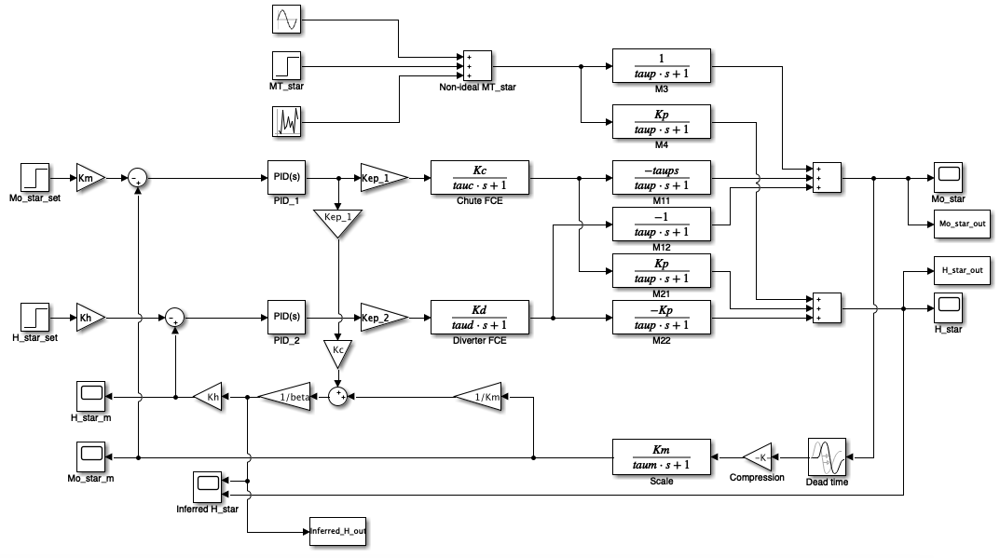

# Simulink Block Model of the PID Control System of a Buffer Silo

This is a MATLAB / Simulink model of the PID control of a multivariable granular system. 

## Mathematical Model of the Buffer Silo

An analytic model of the buffer silo is developed in the "Buffer_Silo_Control.pdf" paper, treating the granular fluid as a liquid with a discharge coefficient.

It was recognised that the outflow velocity is driven by the potential energy of the granular fluid inside the silo. This creates the possibility of inferring the fluid height from the mass outflow. A method to do this is developed using a zero-order approximation of the mass outflow measurement. **This reduces the number of sensors needed to one: a typical weighing scale.**

Two PID controllers are placed in a multiloop arrangement with 1-1/2-2 coupling. They are tuned empirically, using the characteristic equation of the developed closed-loop transfer function and Nyquist diagrams. The system response and stability can be analysed for disturbances, step-changes in the controlled variables, increasing real time-delay and off-measurements.

Overall, the control system proved very robust in handling disturbances, real time delays and off-measurements.

